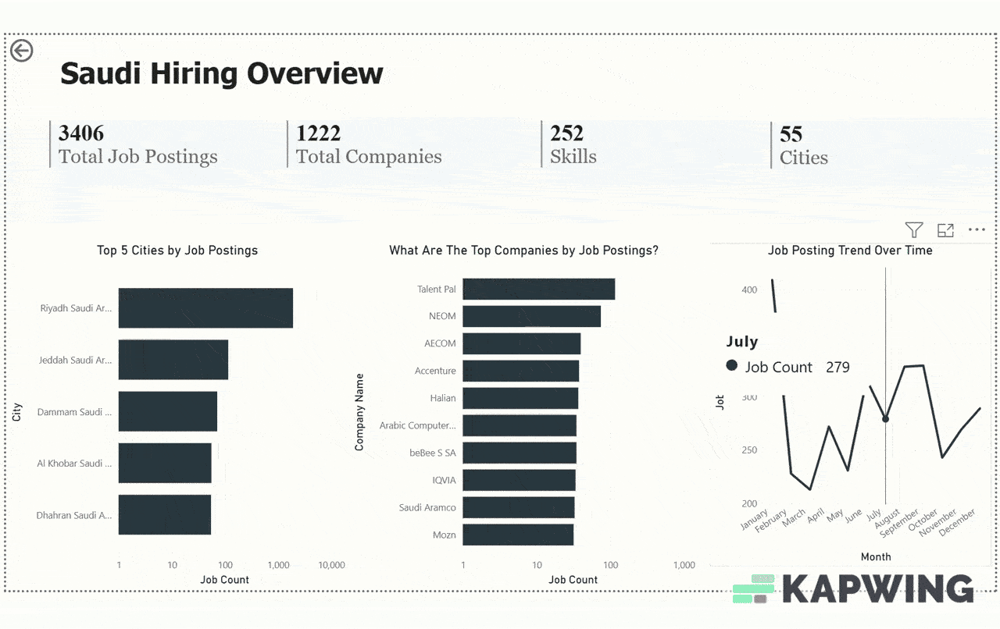

# 📊 Saudi Arabia Data Job Market Dashboard

This project explores the Saudi Arabian data job market using a cleaned and enriched dataset of global job postings, obtained from [Data Nerd](https://datanerd.tech/). The project results in an interactive Power BI dashboard that offers valuable insights into hiring trends, in-demand skills, and top companies across major cities in Saudi Arabia.


---

## 🗂️ Project Structure
```
saudi-data_job-market/
│
├── dashboard/
│ ├── sa_employment_trend.png     # Screenshot of Page 1
│ ├── sa_tech_job_overview.png    # Screenshot of Page 2
│
├── sql/
│ ├── dataset_exploration.sql     # Basic data exploration
│ ├── sa_jobs_overview.sql        # All queries used in dashboard visuals
│ ├── skills_insights.sql         # Advanced insights on skills and roles
│
├── README.md # Project documentation

```
## 🔍 Overview

### This project answers key questions such as:

- Which cities and companies are hiring the most?
- What job roles are in demand?
- What are the top skills required for these roles?
- How does hiring activity vary over time?

---
## 🎥 Dashboard Demo 



## 📊 Dashboard Pages

### 🔹 Page 1: Saudi Hiring Overview

**Key Elements:**
- Cards: Total Jobs, Companies, Skills, Cities
- Bar Chart: Top 5 cities by job postings
- Bar Chart: Top 10 hiring companies
- Line Chart: Job posting trends over time

### 🔹 Page 2: Saudi Arabia Employment Trends

**Key Elements:**
- Slicer: Filter by job role
- Table: Company, Role, Top 5 Required Skills
- Bar Chart: Top 10 job titles
- Map: Distribution of job postings across cities


## 🧠 SQL Logic Summary

SQL logic is divided into three files for clarity:

1. **`dataset_exploration.sql`**  
   Schema review, `DISTINCT` values, and null checks

2. **`sa_jobs_overview.sql`**  
   Queries used directly in the Power BI visuals  
   - Cities, companies, roles, skills, timelines, etc.

3. **`skills_insights.sql`**  
   Deeper insights  
   - Most versatile skills  
   - Skill distribution across companies  
   - Job type breakdown  
   - Source platforms used

---

## 🛠️ Tools Used

- **Power BI**: Data visualization and dashboard creation  
- **PostgreSQL**: SQL-based querying of job postings data  
- **Git & GitHub**: Version control and collaboration  


## 📦 Data Source

- The dataset used in this project was obtained from [Data Nerd](https://datanerd.tech/), which provides enriched and structured job posting data from global sources. This project focuses only on entries related to **Saudi Arabia**.
---


Thanks for checking out this project! 🌟
